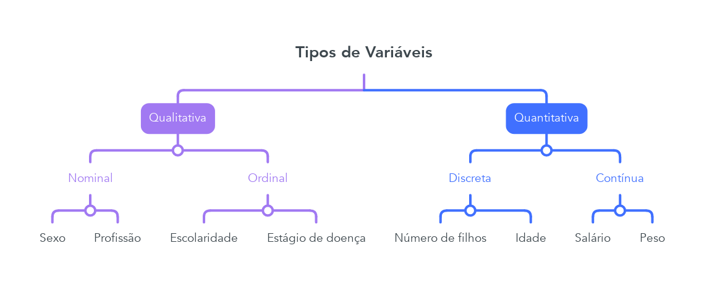
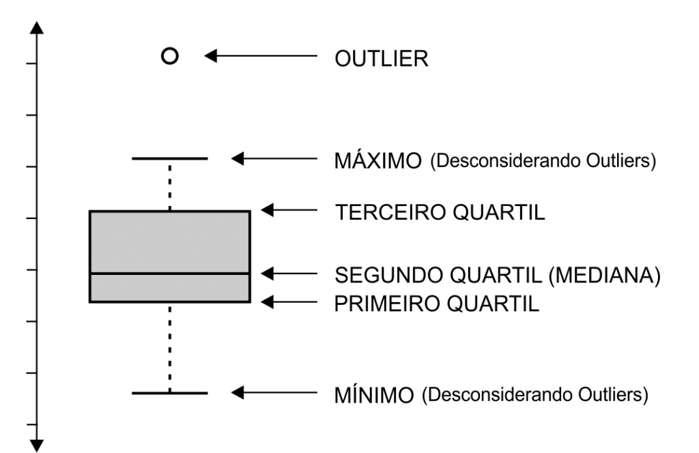

# Medidas Descritivas

```{r include = FALSE}
# Bibliotecas
library(knitr)
library(ggplot2)
library(cowplot)
```

> **Importante:** A partir deste capítulo utilizaremos a função `kable` do pacote `knitr` para visualização de conjuntos de dados. Na prática isto não é necessário, apenas o realizamos para efeitos de visualização.

## Tipos de Variáveis

Antes de analisarmos conjuntos de dados, é necessário termos um conhecimento sobre tipos de variáveis. Para isto, consideremos a seguinte tabela:

```{r youtubers}
nome = c('Djoko','Wilson','Leon', 'Nilce')
est_civil = c('Solteiro','Casado', 'Casado', 'Casado')
escolaridade = c('Pós-graduação',
                 'Ensino médio completo',
                 'Pós-graduação',
                 'Superior completo')
n_filhos = c(0, 0, 0, 0)
salario = c(4500, 3000, 2000, 5500)
idade = c(29, 33, 39, 32)
df_youtubers = data.frame(nome, est_civil, escolaridade, n_filhos, salario, idade)
kable(df_youtubers, align = 'c',
      caption = 'Dados sobre Youtubers.') # Melhor visualização dos dados para este PDF
```

Variáveis como sexo, escolaridade e estado civil apresentam realizações de uma qualidade ou atributo do indivíduo pesquisado, enquanto outras como número de filhos, salário e idade apresentam números como resultados de uma contagem ou mensuração. Chamamos as do primeiro tipo de **qualitativas** e as do segundo de **quantitativas**

Cada uma das duas ainda pode ser dividida em dois tipos:

-   **Variável qualitativa nominal:** atributos não apresentam uma ordem lógica;

-   **Variável qualitativa ordinal:** atributos apresentam uma ordem lógica bem estabelecida;

-   **Variável quantitativa discreta:** dados de contagem, assumem apenas valores inteiros;

-   **Variável quantitativa contínua:** dados que podem assumir qualquer tipo de valor.

    

Muitas vezes queremos resumir estes dados, apresentando um ou mais valores que sejam representativos da série toda. Neste contexto entram às **medidas de posição** e **dispersão**.

## Medidas de Posição

Usualmente utilizamos uma das seguintes medidas de posição (ou localização): **média, mediana ou moda**. Vamos as suas definições:

-   A uma variável atribuiremos a letra $X$ enquanto para seus elementos os valores $x_1, \dots, x_n$, sendo $n$ o seu total de elementos.
-   **Moda:** valor mais frequente do conjunto de valores observados.
-   **Mediana:** valor que ocupa a posição central das observações quando estas estão ordenadas em ordem crescente.
    -   Quando o número de observações for **par**, usa-se como mediana a média aritmética das duas observações centrais.

Na tabela \@ref(tab:youtubers) temos a seguinte mediana para a coluna salário:

```{r}
median(df_youtubers$salario)
```

-   Matematicamente ordenamos os dados do menor para o maior: $2000, 3000, 4500, 5500$, selecionamos as observações centrais $3000$ e $4500$. Por fim, calculamos a média artimética de ambas, $\frac{3000+4500}{2}$, para obtermos a mediana.

Além disso, podemos calcular a mediana para todas as colunas:

```{r}
# apply: aplica uma função a um conjunto de dados
# MARGIN = 2: 1 para aplicar a função a todas as linhas e 2 a todas as colunas
# FUN: função a ser aplicada ao conjunto de dados
apply(df_youtubers[, c('n_filhos','salario','idade')], MARGIN = 2, FUN = median)
```

-   **Média:** soma de todos os elementos do conjunto dividida pela quantidade de elementos do conjunto

    $$
    \overline{x} = \frac{x_1+x_2 + \dots + x_n}{n}
    $$

Na tabela \@ref(tab:youtubers) temos a seguinte média para o salário:

```{r}
mean(df_youtubers$salario)
```

Podemos calcular para todas as colunas que possuam valores numéricos:

```{r}
colMeans(df_youtubers[, c('idade', 'salario')])
```

## Medidas de Dispersão

O **resumo** de um conjunto de dados por uma única medida representativa de posição esconde toda a informação sobre a variabilidade de um conjunto de observações. Consideremos que cinco alunos realizaram cinco provas, obtendo as seguintes notas:

```{r}
nomes = c('alunoA', 'alunoB', 'alunoC',
          'alunoD', 'alunoE')
notas = matrix(c(3,4,5,6,7,
               1,3,5,7,9,
               2,5,5,5,8,
               3,5,5,5,7,
               0,0,5,10,10), nrow = 5, ncol = 5, byrow = T)
df_alunos = data.frame(notas, row.names = nomes)
colnames(df_alunos) = c('P1', 'P2', 'P3', 'P4', 'P5')
kable(df_alunos, align = 'c')
```

Temos as seguintes médias para os alunos:

```{r}
rowMeans(df_alunos)
```

Cada aluno possui a mesma média de notas, porém, isto não informa nada sobre a diferença na **variabilidade das notas.** A partir disto, são criadas medidas que sumarizam a **variabilidade** de um conjunto de observações.

Uma primeira ideia é considerar a soma das diferença dos dados em relação a média:

$$
x_1 - \overline{x} + x_2 - \overline{x} + \cdots + x_n - \overline{x}
$$

Porém, podemos mostrar que em qualquer conjunto a soma destes desvios é igual a zero. Uma alternativa é então adicionar o valor absoluto em cada diferença:

$$
|x_1 - \overline{x}| + |x_2 - \overline{x}| + \cdots + |x_n - \overline{x}|
$$

Apesar de possuir uma boa interpretabilidade, tal métrica não possui propriedades matemáticas interessantes. Assim, estatísticos trabalham com a diferença dos dados em relação a média ao quadrado:

$$
(x_1 - \overline{x})^2 + (x_2 - \overline{x})^2 + \cdots + (x_n - \overline{x})^2
$$

Como muitas vezes queremos comparar conjuntos de dados de diferentes tamanhos, realizamos a divisão desta soma pelo total de elementos em uma amostra e a este número chamamos de **variância**:

$$
\text{var}(X) = \frac{(x_1 - \overline{x})^2 + (x_2 - \overline{x})^2 + \cdots + (x_n - \overline{x})^2}{n}
$$

E a partir disto, definimos **desvio padrão** como sendo a raiz da variância:

$$
\text{dp} = \sqrt{\text{var}(X)}
$$

Realizamos isto pois caso os dados estejam em uma certa unidade de medida, como $cm$ , ao calcularmos a variância passamos a trabalhar com $cm^2$, o que dificulta a interpretabilidade dos resultados. Utilizando o valor na raiz quadrada, voltamos a trabalhar com a unidade de medida utilizada.

## Quantis Empíricos

Tanto a **média** como o **desvio padrão** podem não ser medidas adequadas para representar um conjunto de dados, uma vez que:

-   São afetados por **valores extremos;**

-   Apenas os dois valores não dão informação sobre a **simetria** ou **assimetria** da distribuição dos dados

Vimos que a **mediana** define uma divisão dos dados em duas metades. Além dela existem medidas chamadas de **quantil de ordem p** ou **p-quantil** indicado por $q(p)$ onde $p$ é uma proporção qualquer, $0<p<1$ tal que $100\%$ das observações sejam menores do que $q(p)$.

Abaixo temos alguns dos nomes dos quantis mais utilizados:

-   $q(0.25) = q_1:$ **1° Quartil** ou **25° Percentil**

-   $q(0.50) = q_2:$ **2° Quartil**, **Mediana** ou **50° Percentil**

-   $q(0.75) = q_3:$ **3° Quartil** ou **75° Percentil**

-   $q(0.40) 1:$ **4° Decil**

-   $q(0.95):$ **95° Percentil**

No `R` podemos visualizar os quartis da seguinte forma:

```{r}
quantile(df_alunos$P1)
```

Em várias colunas:

```{r}
apply(df_alunos, 2, quantile, seq(0,1,.2))
```

## Box Plot

A informação contida nos quantis pode ser confusa quando estamos observando vários conjuntos de dados. A partir disto a traduzimos em um diagrama, qual é chamado de **box plot:**

Para construção dessa gráfico definimos por **intervalo interquartil** o valor:

$$
\text{IQ}(X) = q_3 - q_1
$$

Desenhamos um retângulo que parte do primeiro quartil até o terceiro, com a mediana sendo representada por uma linha em seu interior. A partir do retângulo desenhamos uma linha até o maior ponto que não exceta o valor $q_3+1.5 \cdot \text{IQ}(X)$, chamado de limite superior. De modo análogo fazemos o mesmo procedimento até a parte inferior do retângulo considerando o valor $q_1 + 1.5 \cdot \text{IQ}(X)$ chamado de limite interior. As observações que estiverem acima do limite superior ou abaixo do limite superior são chamados de pontos exteriores e representadas por asteriscos. Essas observações podem ser chamaas de outliers ou valores atípicos.



modo simples de como realizar um boxplot pelo R:

```{r}
boxplot(df_alunos)
```

> O aluno mais atento pode se perguntar: porque alguns dos boxplots não possuem a linha superior e/ou inferior? Isto ocorre quando temos muitos dados em uma mesma categoria, com o primeiro ou terceiro quartil tendo o mesmo valor que o mínimo ou máximo do conjunto de dados:

```{r}
apply(df_alunos, 2, quantile)
```

O **box plot** dá uma ideia de posição, dispersão, assimetria dos dados.

```{r}
hist(df_alunos$P4, breaks = seq(5, 10, 1))
```

## Transformações

Vários procedimentos estatísticos são baseados na posição que os dados possuem uma distribuição em forma de sino (distribuição normal) ou que a distribuição seja mais ou menos simétrica:

```{r}
# Simula 500 dados de uma distribuição normal
dados_normal <- rnorm(n = 1000)
# Gráfico de suas frequências
hist(dados_normal)
```

Se quisermos utilizar tais procedimentos podemos efetuar transformações nas observações, de modo a se obter uma distribuição mais simétrica e próxima da normal. As transformações mais frequentemente utilizadas são:

$$
x = \left\{\begin{matrix}&\sqrt{x}\\ &\ln(x) \\&\frac{1}{x}\end{matrix}\right.
$$

para cada transformação obtemos gráficos apropriados para os dados originais e transformados, de modo a escolhermos o valor mais adequado de $p$.

```{r}
dados_gamma <- rgamma(n = 300, shape = 1)
par(mfrow = c(2,2)) # MultiFrame rowwise layout
hist(dados_gamma)
hist(sqrt(dados_gamma))
hist(1/dados_gamma)
hist(log(dados_gamma))
```

## Lab 01 - Conjunto de dados Iris

O conjunto de dados Iris é um dos mais utilizados quando introduzimos conceitos de ciência de dados. Este pode ser encontrado em [UCI Machine Learning Repository](http://archive.ics.uci.edu/ml/index.php). Tal conjunto consiste de 150 amostras de 4 tipos de espécies de flores distintas contendo os atributos:

-   SepalLengthCm

-   SepalWidthCm

-   PetalLengthCm

-   PetalWidthCm

Podemos acessá-lo no R sem nenhum carregamento prévio da seguinte forma:

```{r}
# A função head() mostra os cinco primeiros itens de data.frame:
head(iris)
```

Há certas boas práticas ao carregar um conjunto de dados, dentre elas temos:

-   Visualização de sua dimensão:

    ```{r}
    # O primeiro valor é a quantidade de linhas do conjunto de dados
    # e o segundo a sua quantidade de atributos
    dim(iris)
    ```

-   Visualização do tipo de cada atributo:

    ```{r}
    str(iris) # Structure of an Arbitrary R Object
    ```

-   Sumário de seus atributos:

    ```{r}
    summary(iris)
    ```

Dessa maneira poderemos contatar valores errôneos no conjunto de dados, distribuições de variáveis categóricas e ter um melhor contato com o conjunto de dados.

Há ainda diversas maneiras de realizarmos visualizações desse conjunto no `R`, observemos o boxplot da variável Sepa.Length:

```{r message = TRUE, cache = TRUE}
boxplot(iris$Sepal.Length)
```

```{r cache = TRUE}
ggplot(data = iris, aes(y = Sepal.Length)) +
  geom_boxplot() +
  labs(title = 'Boxplot Iris') +
  theme(axis.ticks.x = element_blank(),
  axis.text.x = element_blank())
```

Observamos que não há presença de outliers, além disso, como a parte debaixo do retângulo separado pela linha que representa a mediana é menor, isto indica que a distribuição dos dados é ligeiramente assimétrica, o qual é confirmado pelo histograma:

```{r echo = TRUE}
hist(iris$Sepal.Length)
```

```{r}
ggplot(data = iris, aes(x = Sepal.Length, fill = ..count..)) +
  geom_histogram(binwidth = 0.25, boundary = 0) +
  scale_x_continuous(breaks = seq(1, 10, by = 0.25)) 
```

## Lab 02 - Xadrez Brasil

Em 2022 houve uma polêmica no universo de xadrez entre o campeão mundial de xadrez Magnus Carlsen e o jovem grande mestre Hanns Niemann, qual possui um histórico de trapaças e foi acusado de repetir estes atos no torneio. Magnus chegou a abandonar o torneio motivado por acreditar que seu oponente utilizava de cheating em sua partida.

Baseado nisso vários estatísticos se debrulharam entre as partidas de Niemann com o objetivo de encontrar evidências de uma ascensão arbitrária a sua posição atual no xadrez. Uma destas analises foi realizada pelo brasileiro Rafael do canal Xadrez Brasil, e nela podemos observar como medidas de posição e dispersão podem ser utilizadas para fortalecermos ou não as evidências de trapaça contra Niemann:

-   <https://www.youtube.com/watch?v=60QPEGsOCyw>
